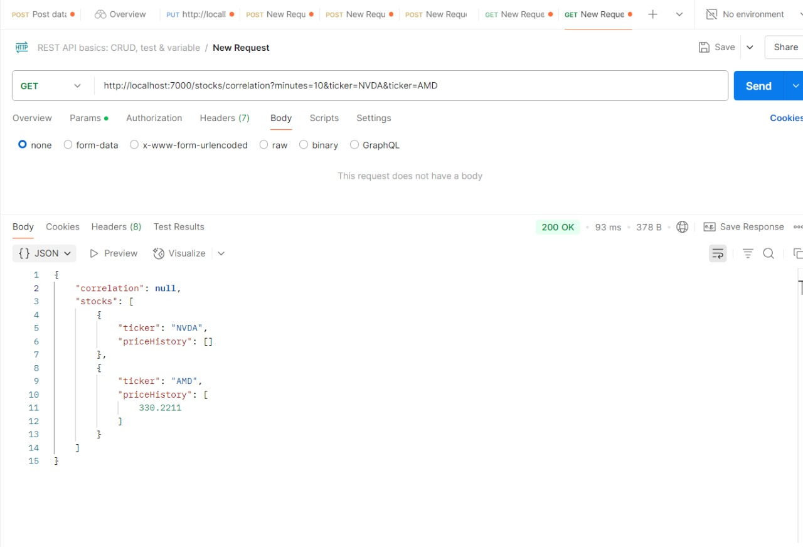
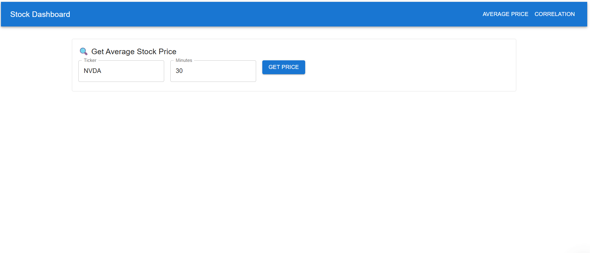

# 📈 Stock Price Microservice

A Node.js backend microservice that provides stock market data for selected tickers.  
It supports:

- Fetching **average stock prices** over the last 10 minutes  
- Generating **correlation heatmaps** between selected stocks

---

## 🔧 Backend Technologies Used

- **Node.js**
- **Express.js**
- **Axios** (for calling external stock data APIs)

---

# 💻 Stock Market Frontend

A React-based frontend application with two main views:

### 1. 📊 Stock Price View  
Displays the average price of selected stocks.

### 2. 🔗 Correlation Heatmap View  
Visualizes the correlation between different stock tickers.

---

## 🛠️ Frontend Technologies

- **React.js** (Functional Components + Hooks)
- **Material UI** (for styling and components)
- **Axios** (for making API requests to the backend)

---

## 🖼️ Screenshots

### ✅ Question 1

  

---

### ✅ Question 2

  
